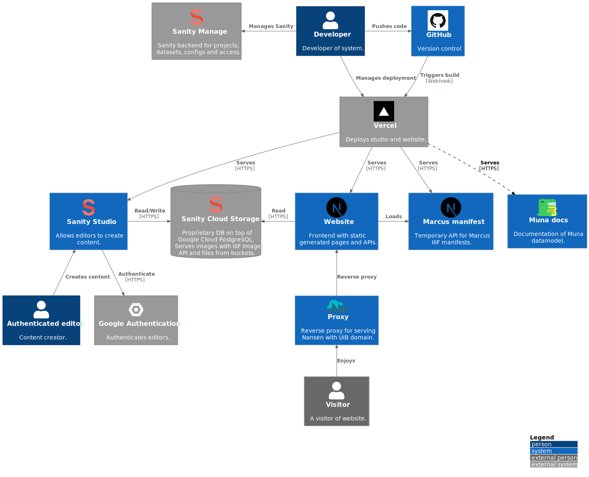
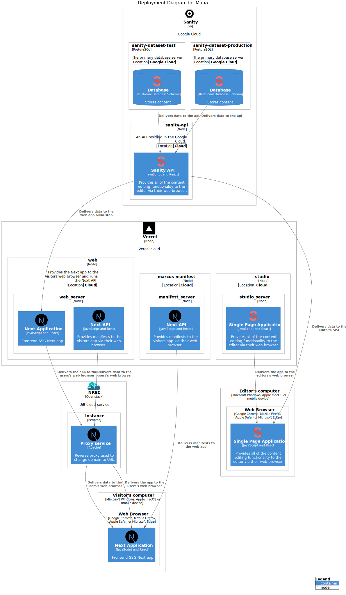

# Muna system

WIP! Muna software architecture. Muna is documented using the [C4 model](https://c4model.com/).

## Context

Software architecture overview.

## Container

Software systems that makes up the whole Muna software architecture.

The repository contains two folders, `studio` and `web`. `studio` contains the code for running the [Sanity Studio](https://www.sanity.io/docs/sanity-studio). 

### Studio

The Studio is a React Single Page Application. It is Open Source and can be customized with plugins and React components. The data model is defined in `studio/schemas`. The studio comes without a schema as default, but there are starter schemas, see [Content modelling](https://www.sanity.io/docs/content-modelling) and [Schema types](https://www.sanity.io/docs/schema-types) for details.

The Studio have one major custom plugin. The `import-tool` is a "tool" for searching Marcus.uib.no, NB.no and Kulturnav.org. Objects or authority data can be imported to the Studio where they can be refered to in text and from othere documents in the studio.

The database is not Open Source and runs in the Google Cloud. The Studio communicates with the backend via an API. It is not necessary to run a local database when developing. Theres is also no need to run a production database.

### Sanity Manage

[Sanity Manage](https://www.sanity.io/manage)

### Web

`web` contains a [Next.js](https://nextjs.org/) application. Next.js was chosen because it supports SSR, SSG and client side rendering and lets the app combine all three strategies.

## Deployment

WIP!

